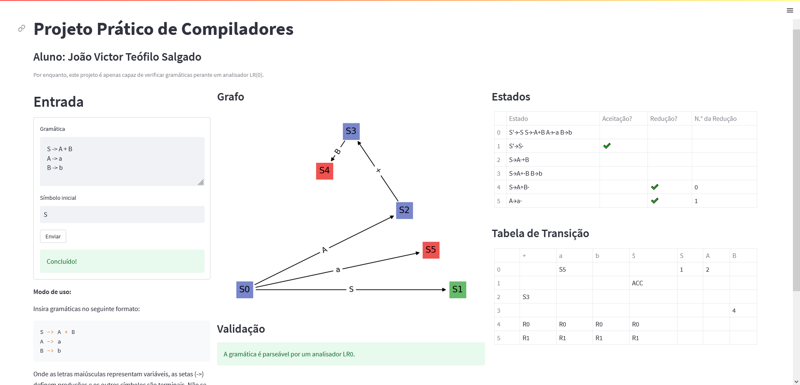

# Projeto Prático de Compiladores (Atividade Alternativa à Prova P3)

Aluno: João Victor Teófilo Salgado

Matrícula: 201810548

### Executando o projeto

```
$ pip install -r requirements.txt
$ streamlit run main.py
```

### Utilizando a ferramenta



Preencha os campos do formulário a esquerda conforme descrito nas instruções da aplicação, informando a gramática e o estado inicial desta.

### Sobre a ferramenta

Esta ferramenta opera apenas sob os analisadores LR(0), gerando o grafo de estados, as tabelas de transição e a verificação se a dada gramática é reconhecível por um dado analisador LR(0).